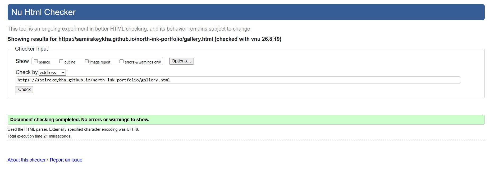

# North Ink — Tattoo Studio Website

[View the live website](https://samirakeykha.github.io/north-ink-portfolio/) · [View the repository](https://github.com/samirakeykha/north-ink-portfolio)

North Ink is a responsive three-page website for a fictional independent tattoo studio in  Norrköping. It helps potential clients understand the studio’s style, browse example work and submit an initial project enquiry.

This project replaces and substantially rebuilds my original first portfolio project. It demonstrates semantic HTML, modern CSS, responsive design, accessibility and user-centred planning without relying on a JavaScript framework.

> North Ink is an educational project. The studio, address, opening hours and services are fictional. Gallery photographs are retained from the original student project and are used here for demonstration purposes.

## User experience

### Goals

- Give first-time visitors a clear understanding of the studio and its approach.
- Help visitors explore tattoo styles and visual examples.
- Provide a simple, accessible route to make an enquiry.
- Work comfortably across mobile, tablet and desktop screens.

### Target users

- Someone considering a first tattoo who needs clear guidance.
- Someone comparing artistic styles before contacting a studio.
- A returning visitor who wants to find the enquiry form quickly.

## Features

### Home

- Strong hero section with two clear calls to action.
- Studio approach and style cards.
- Three-step process explaining what a client can expect.
- Responsive call-to-action and footer sections.

### Gallery

- Responsive editorial image grid.
- Descriptive alternative text for meaningful images.
- Native lazy loading to improve page performance.
- Captions identifying style and concept.

### Enquiry

- Correctly associated and unique form labels and controls.
- Appropriate `email`, `select`, `textarea` and checkbox fields.
- Native browser validation for required information.
- A visible notice explaining that this is a demonstration form.
- Submission to the Code Institute form-dump service in a new tab.

### Accessibility and responsive design

- Semantic landmarks: `header`, `nav`, `main`, `section`, `footer`.
- Keyboard-visible focus states and a skip-to-content link.
- `aria-current` identifies the active page.
- Colour contrast designed for readable text and controls.
- Reduced-motion support through `prefers-reduced-motion`.
- Layout breakpoints for desktop, tablet and mobile.
- Custom 404 page for invalid links.

## Design

The visual direction combines a warm paper background, charcoal text and a clay-red accent. `Playfair Display` gives headings an editorial character, while `DM Sans` keeps navigation, body copy and forms easy to read.

The interface was designed mobile-first in spirit, with fluid type sizes using `clamp()`, CSS Grid for structured layouts and Flexbox for navigation and smaller components.

## Technologies

- HTML5
- CSS3
- CSS Grid and Flexbox
- Google Fonts
- Git and GitHub
- GitHub Pages

## Testing

The following manual checks were completed:

| Test | Expected result | Status |
|---|---|---|
| Navigation links | Each link opens the correct page | Pass |
| Active navigation | Current page is visually and programmatically identified | Pass |
| Enquiry required fields | Empty form cannot be submitted | Pass |
| Email field | Invalid email format is rejected by the browser | Pass |
| External links | Open safely in a new tab | Pass |
| Keyboard navigation | All interactive items can be reached and focused | Pass |
| Mobile layout | No horizontal overflow at 320px width | Pass |
| Reduced motion | Animation is removed when requested by the OS | Pass |
| Missing page | Custom 404 page provides a route home | Pass |

Before release, the HTML and CSS were also checked for broken local links, duplicate IDs and missing image alternative text.

### Validation evidence

All HTML pages were checked with the W3C Markup Validation Service, and the stylesheet was checked with the W3C CSS Validation Service.



## Deployment

The site is deployed with GitHub Pages from the `main` branch:

1. Open the repository **Settings**.
2. Select **Pages** under **Code and automation**.
3. Choose **Deploy from a branch**.
4. Select `main` and the root `/` folder.
5. Save and wait for the published URL to update.

## Run locally

Clone the repository and open `index.html` in a browser:

```bash
git clone https://github.com/samirakeykha/north-ink-portfolio.git
cd north-ink-portfolio
```

No build command or package installation is required.

## Future improvements

- Replace demonstration photographs with fully licensed studio photography.
- Connect the enquiry form to a production form service with a privacy policy.
- Add optional JavaScript form feedback after the JavaScript portfolio module.

## Credits

- Website concept, structure and front-end implementation: Samira Keykha.
- Fonts: [Google Fonts](https://fonts.google.com/).
- Form testing endpoint: [Code Institute Formdump](https://formdump.codeinstitute.net/).

---

Created as Portfolio Project 1 in my full-stack software development learning path.
